# Endergy Alloys

All alloys listed here can be used to craft [[grinding balls|Grinding Balls Endergy]] to enhance the sag mill.

## Crude Steel
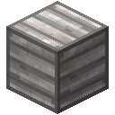
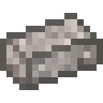
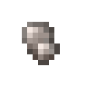

## Crystalline Alloy
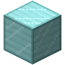
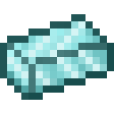

## Melodic Alloy
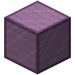
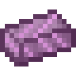
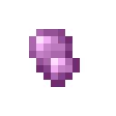

## Stellar Alloy
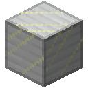
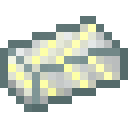
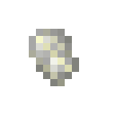

## Crystalline Pink Slime
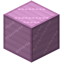
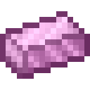

Crystalline Pink Slime Blocks can be used as a beacon base.

## Energetic Silver
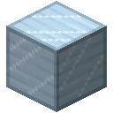

## Vivid Alloy

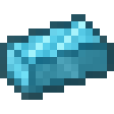

