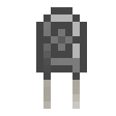

# Capacitors

Capacitors can be used to craft Capacitor Banks, Photovoltaic Cells, Dark Steel Upgrades and various other machines. 

Machines that have an upgrade slot require capacitors to function.

Depending on their Global Level, Capacitors can increase the Speed, Range or Energy Storage of machines.

*Special capacitors with wildly varying properties can be found in loot chests.*

## Basic Capacitor

Global Level: **1**

## Double-Layer Capacitor

Global Level: **2**

## Octadic Capacitor

Global Level: **3**
