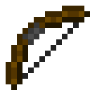

# Dark Bow

The Dark Bow is a bow added by Ender IO.

It can be enchanted with any Bow Enchantments (Vanilla or Modded).

Its stats are very configurable in enderio.cfg: bow{ dark_bow { } }.

It can be repaired in an Anvil using Nutritious Sticks.

## Dark Steel Upgrades:

* Empowered
  - Empowered I
    * Max Power: 100,000 µI
    * Damage absorbed by power: 50%
  - Empowered II
    * Max Power: 150,000 µI
    * Damage absorbed by power: 60%
  - Empowered III
    * Max Power: 250,000 µI
    * Damage absorbed by power: 70%
  - Empowered IV
    * Max Power: 1,000,000 µI
    * Damage absorbed by power: 85%
* Micro Anvil
  - Allows editing upgrades of a single item in the field.
  - Activate with a hotkey or by shift-right-clicking any upgradeable item that doesn't do anything else when doing that.
* Mini Anvil
  - Allows editing upgrades of all equiped items in the field.
  - Activate with a hotkey or by shift-right-clicking any upgradeable item that doesn't do anything else when doing that.
* Pocket Anvil
  - Provides full anvil functionality and allows editing upgrades of any items in the field.
  - Activate with a hotkey or by shift-right-clicking any upgradeable item that doesn't do anything else when doing that.