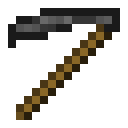

# Dark Crook

>*One Click Deforestation.*

The Dark Axe is a crook added by Ender IO.

It can be enchanted with any Crook Enchantments (Modded).

It works exactly like the Ex Nihilo Crook (and is also compatible with it) and when empowered it will do AOE.

## Dark Steel Upgrades:

* Direct 
  - Teleports mined things into your inventory
* Empowered
  - Empowered I
    * Max Power: 100,000 µI
    * Damage absorbed by power: 50%
  - Empowered II
    * Max Power: 150,000 µI
    * Damage absorbed by power: 60%
  - Empowered III
    * Max Power: 250,000 µI
    * Damage absorbed by power: 70%
  - Empowered IV
    * Max Power: 1,000,000 µI
    * Damage absorbed by power: 85%
* Fork
  - Who needs a hoe when you have a fork...
