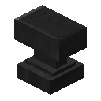
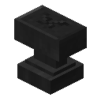
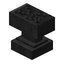

# Dark Paper Anvil

The Dark Paper Anvil is an anvil added by Ender IO.

It is crafted using 7 pieces of Black Paper placed in an Anvil Shape

It is ***Not Durable***.

***It lasts much shorter than the Vanilla Anvil.***

**It can be used to apply and remove upgrades.**
