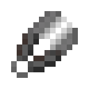

# Dark Shears

The Dark Shears are shears added by Ender IO.

They can be enchanted with any Shears Enchantments (Vanilla or Modded).

They can also break Tripwire without activating the Tripwire Hooks, just like the Vanilla Shears.

## Dark Steel Upgrades:

* Direct 
  - Teleports mined things into your inventory
* Empowered
  - Empowered I
    * Max Power: 100,000 µI
    * Damage absorbed by power: 50%
  - Empowered II
    * Max Power: 150,000 µI
    * Damage absorbed by power: 60%
  - Empowered III
    * Max Power: 250,000 µI
    * Damage absorbed by power: 70%
  - Empowered IV
    * Max Power: 1,000,000 µI
    * Damage absorbed by power: 85%
