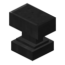
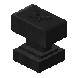
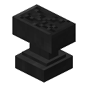

# Dark Steel Anvil

The Dark Steel Anvil is an anvil added by Ender IO.

It is ***Fall Damage Resistant***.

***It lasts much longer than the Vanilla Anvil.***

**It can be used to apply and remove upgrades.**

***Working with Dark Steel Upgrades does not consume durability.***