# Dark Steel Upgrades

**Ender IO adds multiple Dark Steel Upgrades that can be applied in a [[Dark Steel Anvil]], [[Dark Paper Anvil]] or Dark/Ender/Stellar item with an Anvil Upgrade to Dark, Ender, and Stellar Weapons, Tools, and Armor.**

For a Player guide on how to use the Dark Steel Upgrade system, see [[Guide: Dark Steel Upgrades|Guide Dark Steel Upgrades]].

For a Pack Author/Server Admin guide to disabling upgrades, see [[Disabling Upgrades]].

## Blank Dark Steel Upgrade
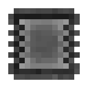

* Made in the Alloy Smelter with Dark Iron Bars, Clay, and 4 pieces of String
* Cannot be applied to anything
* Used to make all the other Dark Steel Upgrades

## Dark Steel Upgrade "Micro Anvil"
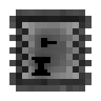

* Crafted with a Blank Upgrade, 2 Sticks, and 2 Dark Steel Nuggets
* Upgrade for Dark Steel Items
  - Allows editing upgrades of a single item in the field.
  - Activate with a hotkey or by shift-right-clicking any upgradeable item that doesn't do anything else when doing that.
* Can be applied to:
  - Any Dark Steel Item
* **1 level needed to activate this upgrade**
  - (Activate this item by right-clicking)

## Dark Steel Upgrade "Mini Anvil"

* Crafted with a Blank Upgrade, 2 Sticks, and 2 Dark Steel Ingots
* Upgrade for Dark Steel Items
  - Allows editing upgrades of all equiped items in the field.
  - Activate with a hotkey or by shift-right-clicking any upgradeable item that doesn't do anything else when doing that.
* Depends on:
  - Micro Anvil
* Can be applied to:
  - Any Dark Steel Item
* **2 levels needed to activate this upgrade**
  - (Activate this item by right-clicking)

## Dark Steel Upgrade "Pocket Anvil"

* Crafted with a Blank Upgrade, a Dark Steel Anvil, 2 Sticks, and a Dark Steel Block
* Upgrade for Dark Steel Items
  - Provides full anvil functionality and allows editing upgrades of any items in the field.
  - Activate with a hotkey or by shift-right-clicking any upgradeable item that doesn't do anything else when doing that.
* Depends on:
  - Mini Anvil
* Can be applied to:
  - Any Dark Steel Item
* **4 levels needed to activate this upgrade**
  - (Activate this item by right-clicking)

## Dark Steel Upgrade "Carpeting"

* Crafted with a Blank Upgrade and a Carpet
* Upgrade for Dark Steel Items
  - Flatens the explosive force into a carpet.
* Depends on:
  - Explosive I
* Can be applied to:
  - Dark, Ender and Stellar Pickaxes
* **8 levels needed to activate this upgrade**
  - (Activate this item by right-clicking)

## Dark Steel Upgrade "Depth"

* Crafted with a Blank Upgrade and a Creeper Head
* Upgrade for Dark Steel Items
  - Directs the explosive force away from the player.
* Depends on:
  - Explosive I
* Can be applied to:
  - Dark, Ender, and Stellar Pickaxes
* **8 levels needed to activate this upgrade**
  - (Activate this item by right-clicking)

## Dark Steel Upgrade "Direct"

* Crafted with a Blank Upgrade, an Ender Pearl, 3 Vibrant Alloy Ingots, and 4 Vibrant Alloy Nuggets
* Upgrade for Dark Steel Items
  - Teleports mined things directly into your inventory
* Depends on:
  - Empowered
* Can be applied to:
  - Dark, Ender, and Stellar Weapons
  - Dark, Ender, and Stellar Tools
* **8 levels needed to activate this upgrade**
  - (Activate this item by right-clicking)

## Dark Steel Upgrade "Elytra"
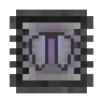
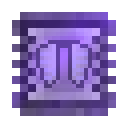

* Crafted with a Blank Upgrade and an Elytra
* Upgrade for Dark Steel Items
  - Makes armor work as elytra
  - *(That means flying as if an Elytra was equipped, NOT "creative" flight!)*
  - Set the hotkey to activate/deactivate it in the game options
  - ***Incompatible with Glider***
* Can be applied to:
  - Dark, Ender, and Stellar Chestplates
* **10 levels needed to activate this upgrade**
  - (Activate this item by right-clicking)

## Dark Steel Upgrade "Empowered"
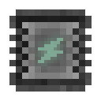
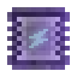

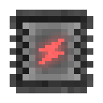
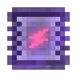

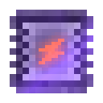

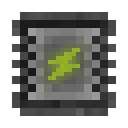
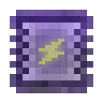

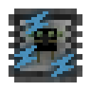
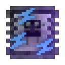

* There are 5 levels of Empowered:
  - Empowered I: Crafted with a Blank Upgrade and a Vibrant Crystal
  - Empowered II: Crafted with a Blank Upgrade and a Basic Capacitor
  - Empowered III: Crafted with a Blank Upgrade and a Double-Layer Capacitor
  - Empowered IV: Crafted with a Blank Upgrade and an Octadic Capacitor
  - Empowered V: Crafted with a Blank Upgrade and a Tormented Enderman Head
* Upgrade for Dark Steel Items
* Empowered II-V depend on the previous level
* Can be applied to:
  - Any Dark, Ender or Stellar Item (Empowered I-IV)
  - Any Ender or Stellar Item (*Empowered V*)
* **Needed levels to activate these upgrades**
  - Empowered I: 4 levels
  - Empowered II: 8 levels
  - Empowered III: 12 levels
  - Empowered IV: 16 levels
  - Empowered V: 20 levels
* (Activate these items by right-clicking)

## Dark Steel Upgrade "Glider"
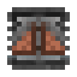

* Crafted with a Blank Upgrade and Glider Wings
* Upgrade for Dark Steel Items
  - Enables Gliding
  - Set the hotkey to activate/deactivate it in the game options
  - ***Incompatible with Elytra***
* Can be applied to:
  - Dark, Ender, and Stellar Chestplates
* **4 levels needed to activate this upgrade**
  - (Activate this item by right-clicking)

## Dark Steel Upgrade "Fork"
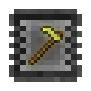
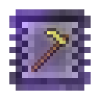

* Crafted with a Blank Upgrade and a Diamond Hoe
* Upgrade for Dark Steel Items
  - Who needs a hoe when you have a fork...
* Depends on:
  - Empowered
* Can be applied to:
  - Dark, Ender, and Stellar Axes
  - Dark Crooks
* **4 levels needed to activate this upgrade**
  - (Activate this item by right-clicking)

## Dark Steel Upgrade "Inventory"
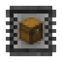

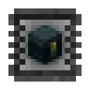

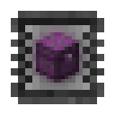

* There are 3 levels of Inventory:
  - Inventory I: Crafted with a Blank Upgrade, a Chest, and a Wooden Gear
  - Inventory II: Crafted with a Blank Upgrade, a Chest, and an Energized Bimetal Gear
  - Inventory III: Crafted with a Blank Upgrade, a Chest, and a Vibrant Bimetal Gear
* Upgrade for Dark Steel Items
  - Inventory I
    * Adds an inventory to you armor
    * The size depends on the armor type
    * Set the hotkey to open it in the game options
  - Inventory II-III
    * Increase the size of your armor's inventory
    * Set the hotkey to open it in the game options
* Depends on:
  - Empowered
  - Inventory II-III depend on the previous level
* Can be applied to:
  - Dark, Ender, and Stellar Armor Pieces
* **Needed levels to activate these upgrades**
  - Inventory I: 12 levels
  - Inventory II: 20 levels
  - Inventory III: 32 levels
* (Activate these items by right-clicking)

## Dark Steel Upgrade "Jump"
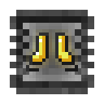

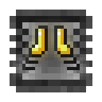

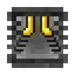

* There are 3 levels of Jump:
  - Jump I: Crafted with a Blank Upgrade, a Piston, and a Wooden Gear
  - Jump II: Crafted with a Blank Upgrade, a Piston, and an Energized Bimetal Gear
  - Jump III: Crafted with a Blank Upgrade, a Piston, and a Vibrant Bimetal Gear
* Upgrade for Dark Steel Items
  - Increases step and jump height
  - Jump II allows double jumps
  - Jump III allows triple jumps
  - Set the hotkey to activate/deactivate it in the game options
* Depends on:
  - Empowered
  - Jump II-III depend on the previous level
* Can be applied to:
  - Dark, Ender, and Stellar Boots
* **Needed levels to activate these upgrades**
  - Jump I: 4 levels
  - Jump II: 6 levels
  - Jump III: 8 levels
* (Activate these items by right-clicking)

## Dark Steel Upgrade "Night Vision"

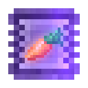

* Crafted with a Blank Upgrade and a Potion of Night Vision
* Upgrade for Dark Steel Items
  - Gives you the Night Vision Effect indefinitely(you can activate/deactivate it)
  - Set the hotkey to activate/deactivate it in the game options
* Can be applied to:
  - Dark, Ender, and Stellar Helmets
* **4 levels needed to activate this upgrade**
  - (Activate this item by right-clicking)

## Dark Steel Upgrade "Padding"

* Crafted with a Blank Upgrade and a piece of Wool
* Upgrade for Dark Steel Items
  - Muffles nearby sound
* Can be applied to:
  - Dark, Ender, and Stellar Helmets
* **4 levels needed to activate this upgrade**
  - (Activate this item by right-clicking)

## Dark Steel Upgrade "Solar"
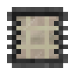

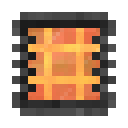
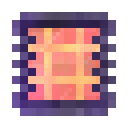

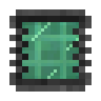
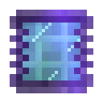

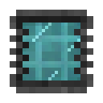
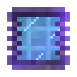

* There are 4 levels of Solar:
  - Simple Solar: Crafted with a Blank Upgrade and a Simple Photovoltaic Cell
  - Solar I: Crafted with a Blank Upgrade and a Photovoltaic Cell
  - Solar II: Crafted with a Blank Upgrade and an Advanced Photovoltaic Cell
  - Solar III: Crafted with a Blank Upgrade and a Vibrant Photovoltaic Cell
* Upgrade for Dark Steel Items
  - Generates power from the sun
* Depends on:
  - Empowered
  - Solar I-III depend on the previous level
* Can be applied to:
  - Dark, Ender, and Stellar Helmets
* **Needed levels to activate these upgrades**
  - Simple Solar: 4 levels
  - Solar I: 8 levels
  - Solar II: 16 levels
  - Solar III: 24 levels
* (Activate these items by right-clicking)

## Dark Steel Upgrade "Sound Locator"

* Crafted with a Blank Upgrade and a Note Block
* Upgrade for Dark Steel Items
  - Displays the Location of nearby sounds nearby sound
  - Set the hotkey to activate/deactivate it in the game options
* Can be applied to:
  - Dark, Ender, and Stellar Helmets
* **4 levels needed to activate this upgrade**
  - (Activate this item by right-clicking)

## Dark Steel Upgrade "Speed"

* There are 3 levels of Speed:
  - Speed I: Crafted with a Blank Upgrade, a Potion of Swiftness, and a Wooden Gear
  - Speed II: Crafted with a Blank Upgrade, a Potion of Swiftness, and an Energized Bimetal Gear
  - Speed III: Crafted with a Blank Upgrade, a Potion of Swiftness, and a Vibrant Bimetal Gear
* Upgrade for Dark Steel Items
  - Increases movement speed
  - Set the hotkey to activate/deactivate it in the game options
* Depends on:
  - Empowered
  - Speed II-III depend on the previous level
* Can be applied to:
  - Dark, Ender, and Stellar Leggings
* **Needed levels to activate these upgrades**
  - Speed I: 4 levels
  - Speed II: 6 levels
  - Speed III: 8 levels
* (Activate these items by right-clicking)

## Dark Steel Upgrade "Spoon"
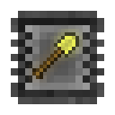
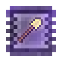

* Crafted with a Blank Upgrade and a Diamond Shovel
* Upgrade for Dark Steel Items
  - Who needs a shovel when you have a spoon...
* Depends on:
  - Empowered
* Can be applied to:
  - Dark, Ender, and Stellar Pickaxes
* **4 levels needed to activate this upgrade**
  - (Activate this item by right-clicking)

## Dark Steel Upgrade "Step Assist"
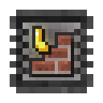
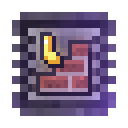

* Crafted with a Blank Upgrade and 5 Bricks
* Upgrade for Dark Steel Items
  - Allows you to walk up blocks as if they were stairs.
* Depends on:
  - Empowered
  - Jump
* Can be applied to:
  - Dark, Ender, and Stellar Boots
* **2 levels needed to activate this upgrade**
  - (Activate this item by right-clicking)

## Dark Steel Upgrade "Flippers"
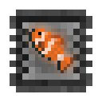

* Crafted with a Blank Upgrade and a Lily Pad
* Upgrade for Dark Steel Items
  - Increases swimming speed
* Can be applied to:
  - Dark, Ender, and Stellar Boots
* **4 levels needed to activate this upgrade**
  - (Activate this item by right-clicking)

## Dark Steel Upgrade "Explosive"

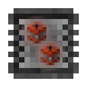

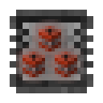

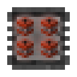

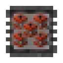

* There are 5 levels of Explosive:
  - Explosive I: Crafted with a Blank Upgrade, a piece of TNT, and a Wooden Gear
  - Explosive II: Crafted with a Blank Upgrade, a piece of TNT, and a Stone Compound Gear
  - Explosive III: Crafted with a Blank Upgrade, a piece of TNT, and an Infinity Bimetal Gear
  - Explosive IV: Crafted with a Blank Upgrade, a piece of TNT, and an Energized Bimetal Gear
  - Explosive V: Crafted with a Blank Upgrade, a piece of TNT, and a Vibrant Bimetal Gear
* Upgrade for Dark Steel Items
  - Explosive I:
    * Adds explosive power to the pickaxe, damaging surrounding blocks while mining.
    * For problems that look like nails.
  - Explosive II:
    * Adds more explosive power to the pickaxe, damaging surrounding blocks while mining.
    * For problems that look like nails.
  - Explosive III:
    * Adds even more explosive power to the pickaxe, damaging surrounding blocks while mining.
    * For problems that look like nails.
  - Explosive IV:
    * Adds ridiculous explosive power to the pickaxe, damaging surrounding blocks while mining.
    * For problems that look like combs.
  - Explosive V:
    * Adds ludicrous explosive power to the pickaxe, damaging surrounding blocks while mining.
    * [Space Balls - Ludicrous Speed](https://youtu.be/ygE01sOhzz0)

      ***Henry and tterrag want you to watch the full movie.***

      ***"You owe it to yourself" - tterrag***
* Depends on:
  - Empowered
* Can be applied to:
  - Dark, Ender, and Stellar Pickaxes
* **Needed levels to activate these upgrades**
  - Explosive I: 8 levels
  - Explosive II: 12 levels
  - Explosive III: 18 levels
  - Explosive IV: 26 levels
  - Explosive V: 36 levels
* (Activate these items by right-clicking)

## Dark Steel Upgrade "Travel"
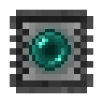

* Crafted with a Blank Upgrade and an Ender Crystal
* Upgrade for Dark Steel Items
  - Hold Shift and Right-Click to teleport or activate a travel anchor
* Depends on:
  - Empowered
* Can be applied to:
  - Dark, Ender, and Stellar Swords
  - Dark, Ender, and Stellar Pickaxes
* **16 levels needed to activate this upgrade**
  - (Activate this item by right-clicking)

## The One Probe Integration

### Dark Steel Upgrade "The One Probe"
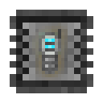

* Crafted with a Blank Upgrade and (TOP)The One Probe
* Upgrade for Dark Steel Items
  - Adds TOP functionality to the Helmets
* Can be applied to:
  - Dark, Ender, and Stellar Helmets
* **4 levels needed to activate this upgrade**
  - (Activate this item by right-clicking)

## Forestry Integration

### Dark Steel Upgrade "Naturalist's Eye"
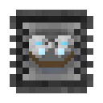

* Crafted with a Blank Upgrade and (Forestry)Spectacles
* Upgrade for Dark Steel Items
  - Shows pollinated tree leaves
* Can be applied to:
  - Dark, Ender, and Stellar Helmets
* **4 levels needed to activate this upgrade**
  - (Activate this item by right-clicking)

### Dark Steel Upgrades "Apiarist's Clothes/Armor"
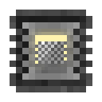

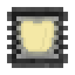

* There are 4 upgrades corresponding to the 4 pieces:
  - Apiarist's Hat: Crafted with a Blank Upgrade and the Apiarist's Hat
  - Apiarist's Shirt: Crafted with a Blank Upgrade and the Apiarist's Shirt
  - Apiarist's Pants: Crafted with a Blank Upgrade and the Apiarist's Pants
  - Apiarist's Shoes: Crafted with a Blank Upgrade and the Apiarist's Shoes
* Upgrades for Dark Steel Items
  - Protection against bees
* Can be applied to:
  - Dark, Ender, and Stellar Helmets (Apiarist's Hat)
  - Dark, Ender, and Stellar Chestplates (Apiarist's Shirt)
  - Dark, Ender, and Stellar Leggings (Apiarist's Pants)
  - Dark, Ender, and Stellar Boots (Apiarist's Shoes)
* **4 levels needed to activate these upgrades**
  - (Activate these items by right-clicking)

## Thaumcraft Integration

### Dark Steel Upgrade "Revealing"

* Crafted with a Blank Upgrade and the (Thaumcraft)Goggles of Revealing
* Upgrade for Dark Steel Items
  - Vis Discount 5%
* Can be applied to:
  - Dark, Ender, and Stellar Helmets
* **4 levels needed to activate this upgrade**
  - (Activate this item by right-clicking)

### Dark Steel Upgrade "Thaumaturge's Robe"
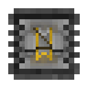

* Crafted with a Blank Upgrade and the (Thaumcraft)Thaumaturge's Robe
* Upgrade for Dark Steel Items
  - Vis Discount 3%
* Can be applied to:
  - Dark, Ender, and Stellar Chestplates
* **4 levels needed to activate this upgrade**
  - (Activate this item by right-clicking)

### Dark Steel Upgrade "Thaumaturge's Leggings"
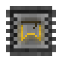

* Crafted with a Blank Upgrade and the (Thaumcraft)Thaumaturge's Leggings
* Upgrade for Dark Steel Items
  - Vis Discount 3%
* Can be applied to:
  - Dark, Ender, and Stellar Leggings
* **4 levels needed to activate this upgrade**
  - (Activate this item by right-clicking)

### Dark Steel Upgrade "Thaumaturge's Boots"
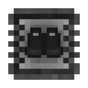

* Crafted with a Blank Upgrade and the (Thaumcraft)Thaumaturge's Boots
* Upgrade for Dark Steel Items
  - Vis Discount 2%
* Can be applied to:
  - Dark, Ender, and Stellar Boots
* **4 levels needed to activate this upgrade**
  - (Activate this item by right-clicking)