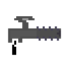

# Dark Treetap

The Dark Treetap is a treetap added by Ender IO.

It can be enchanted with any Treetap Enchantments (Vanilla or Modded).

It extracts Resin from Rubber Trees, just like the IC2 treetap, but with one big difference:

### ***Farming Station Use Only***

## Dark Steel Upgrades:

* Empowered
  - Empowered I
    * Max Power: 100,000 µI
    * Damage absorbed by power: 50%
  - Empowered II
    * Max Power: 150,000 µI
    * Damage absorbed by power: 60%
  - Empowered III
    * Max Power: 250,000 µI
    * Damage absorbed by power: 70%
  - Empowered IV
    * Max Power: 1,000,000 µI
    * Damage absorbed by power: 85%
