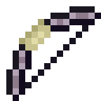

# Ender Bow

The Ender Bow is a bow added by Ender IO.

It can be enchanted with any Bow Enchantments (Vanilla or Modded).

Its stats are very configurable in enderio.cfg: bow{ end_bow { } }.

It can be repaired in an Anvil using Infinity Rods.

## Dark Steel Upgrades:

* Empowered
  - Empowered I
    * Max Power: 100,000 µI
    * Damage absorbed by power: 50%
  - Empowered II
    * Max Power: 150,000 µI
    * Damage absorbed by power: 60%
  - Empowered III
    * Max Power: 250,000 µI
    * Damage absorbed by power: 70%
  - Empowered IV
    * Max Power: 1,000,000 µI
    * Damage absorbed by power: 85%
  - Empowered V
    * Max Power: 2,500,000 µI
    * Damage absorbed by power: 95%
