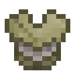

# Ender Plate

The Ender Plate is a chestplate added by Ender IO.

It can be enchanted with any Chestplate Enchantments (Vanilla or Modded).

## Dark Steel Upgrades:
* Apiarist's Shirt (Forestry Integration)
  - Protection against bees
* Elytra
  - Makes armor work as elytra
  - *(That means flying as if an Elytra was equipped, NOT "creative" flight!)*
  - Set the hotkey to activate/deactivate it in the game options
  - ***Incompatible with Glider***
* Empowered
  - Empowered I
    * Max Power: 100,000 µI
    * Damage absorbed by power: 50%
  - Empowered II
    * Max Power: 150,000 µI
    * Damage absorbed by power: 60%
  - Empowered III
    * Max Power: 250,000 µI
    * Damage absorbed by power: 70%
  - Empowered IV
    * Max Power: 1,000,000 µI
    * Damage absorbed by power: 85%
  - Empowered V
    * Max Power: 2,500,000 µI
    * Damage absorbed by power: 95%
* Glider
  - Enables Gliding
  - Set the hotkey to activate/deactivate it in the game options
  - ***Incompatible with Elytra***
* Inventory
  - Inventory I
      * Adds an inventory to you armor
      * The size depends on the armor type
      * Set the hotkey to open it in the game options
  - Inventory II
    * Increases the size of your armor's inventory
    * Set the hotkey to open it in the game options
  - Inventory III
    * Increases the size of your armor's inventory
    * Set the hotkey to open it in the game options
* Thaumaturge's Robe   (Thaumcraft Integration)
  - Vis Discount: 3%
