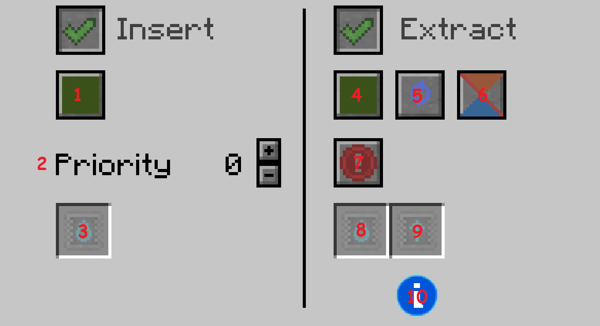

# Fluid Conduits

The Fluid Conduits transfer fluids between tanks.

## There are 3 types of Fluid Conduits:

### Fluid Conduit

This is the first tier.

It has a Max Extract Speed of 50 mB/t.

It has Max IO: Speed of 200 mB/t.

It has configurable Redstone Mode.

**It's Fluid Flow Respects Gravity!**

*Its Flow Rate is dependent on Fluid Viscosity!*

### Pressurized Fluid Conduit

This is the second tier.

It has a Max Extract Speed of 100 mB/t.

It has Max IO Speed of 400 mB/t.

It has configurable Redstone Mode.

### Ender Fluid Conduit

This is the third tier.

It has a Max Extract Speed of 200 mB/t.

It has Max IO Speed of 800 mB/t.

**It instantly teleports fluids between the conduit bundles(connections with tanks).**

**It allows multiple fluids to be transported on the same line.**

It also has extra options in its GUI that the other types don't: Channels(Insertion and Extraction), Priority(Insertion), Filter Upgrades(Insertion and Extraction), Round Robin(Extraction), Self Feed(Extraction), Function Upgrades(Extraction).

## The GUI of all Fluid conduits is split between their 2 modes: *insert* and *extract*. These modes can be toggled independently.

### Insert

Insertion can be configured in these ways:

#### Channels (*1*) (Ender Fluid Conduits only)

Channels are used to split a single fluid conduit network into multiple networks that act independently.

There are 16 different channels. Each of them has a different color, corresponding to the 16 minecraft colors: 

Green, Brown, Blue, Purple, Cyan, Light Gray, Gray, Pink, Lime, Yellow, Light Blue, Magenta, Orange, White, Black

#### Priority (*2*) (Ender Fluid Conduits only)

The insertion uses the priority system. The priority is represented by an integer.

*The fluids will be inserted into the tanks with the highest priority first.*

#### Filter Upgrades (*3*) (Ender Fluid Conduits only)

Insertion can be filtered. There is a single slot for filters.

### Extract

Extraction can be configured in these ways:

#### Channels (*4*) (Ender Fluid Conduits only)

Channels are used to split a single fluid conduit network into multiple networks that act independently.

There are 16 different channels. Each of them has a different color, corresponding to the 16 minecraft colors: 

Green, Brown, Blue, Purple, Cyan, Light Gray, Gray, Pink, Lime, Yellow, Light Blue, Magenta, Orange, White, Black

#### Round Robin (*5*) (Ender Fluid Conduits only)

If Round Robin is disabled, fluids will be inserted normally, Nearest-First, into the tanks with the highest priority.

If Round Robin is enabled, fluids will be split equally between the tanks with the highest priority.

#### Self Feed (*6*) (Ender Fluid Conduits only)

If Self Feed is enabled, the conduits will be able to insert fluids into the tank from which they extracted them.

#### Redstone Mode (*7*) (All Fluid Conduits)

Controls when the extraction should happen in regards to *Redstone Signal*. It can be set to these modes:

##### Always active
Extraction is always active, ignoring redstone signal.

##### Active with signal
Extraction only happens if the conduit receives a redstone signal(power 1-15).

If the redstone signal is transmitted by a redstone conduit, the Signal Color can be set.

##### Active without signal
Extraction only happens if the conduit doesn't receive a redstone signal(power 0).

If the redstone signal is transmitted by a redstone conduit, the Signal Color can be set.

##### Never active
Extraction is never active, ignoring redstone signal.

#### Filter Upgrades (*8*) (Ender Fluid Conduits only)

Extraction can be filtered. There is a single slot for filters.

#### Function Upgrades (*9*) (Ender Fluid Conduits only)

The Speed of the Extraction can be modified using *Speed Upgrades* and *Speed Downgrades*.

By default, ender fluid conduits have an extraction speed of 200 mB/t, which represents 100%.

There's an info button (*10*) in the GUI that shows the *Effective Speed* while Hovering.

##### Speed Upgrades

Every added Speed Upgrade increases extraction speed by 100%.

*The Maximum Amount of Speed Upgrades that can be added in a fluid conduit is 15*, for a maximum extraction speed of 3200 mB/t!

##### Speed Downgrades

*The Maximum Amount of Speed Downgrades that can be added in a fluid conduit is 3!*

**1 added Speed Downgrade decreases extraction speed to 25% fluid per operation(*THE MINIMUM EXTRACTION SPEED = 50 mB/t*).**

**2 added Speed Downgrades decrease extraction speed to 50% fluid per operation(= 100 mB/t).**

**3 added Speed Downgrades decrease extraction speed to 75% fluid per operation(= 150 mB/t).**

Note:

mB = milibuckets = 1/1000 Buckets

IO = Input/Output
