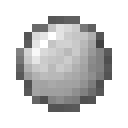
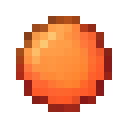
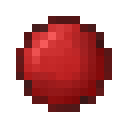
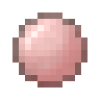
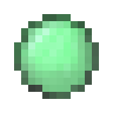
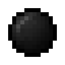
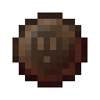
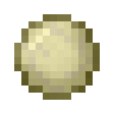
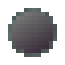

# Grinding Balls

## Electrical Steel Grinding Ball

Main Output 120%

Bonus Output 165%

Power Use 80%

## Energetic Alloy Grinding Ball

Main Output 160%

Bonus Output 110%

Power Use 110%

## Vibrant Alloy Grinding Ball

Main Output 175%

Bonus Output 135%

Power Use 135%

## Redstone Alloy Grinding Ball

Main Output 100%

Bonus Output 100%

Power Use 35%

## Conductive Iron Grinding Ball

Main Output 135%

Bonus Output 100%

Power Use 100%

## Pulsating Iron Grinding Ball

Main Output 100%

Bonus Output 185%

Power Use 100%

## Dark Steel Grinding Ball

Main Output 135%

Bonus Output 200%

Power Use 70%

## Soularium Grinding Ball

Main Output 120%

Bonus Output 215%

Power Use 90%

## End Steel Grinding Ball

Main Output 140%

Bonus Output 240%

Power Use 70%

## Iron Alloy Grinding Ball

Main Output 100%

Bonus Output 25%

Power Use 25%
