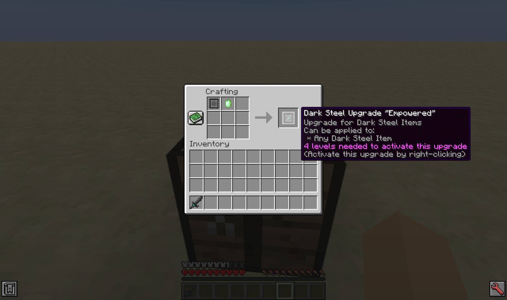
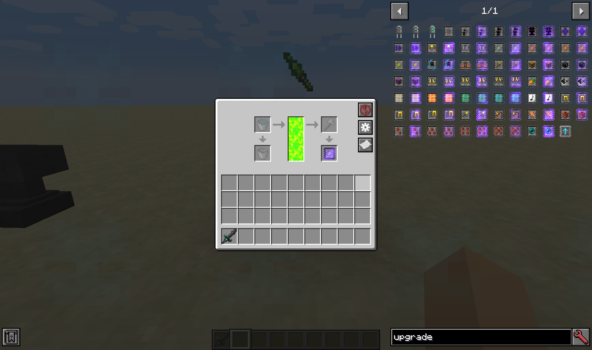
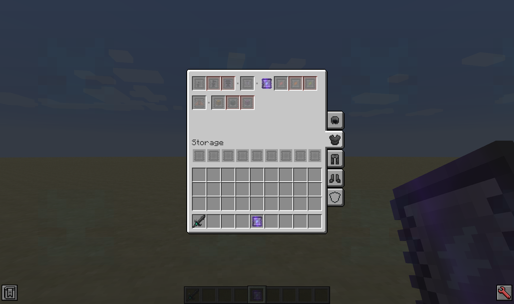
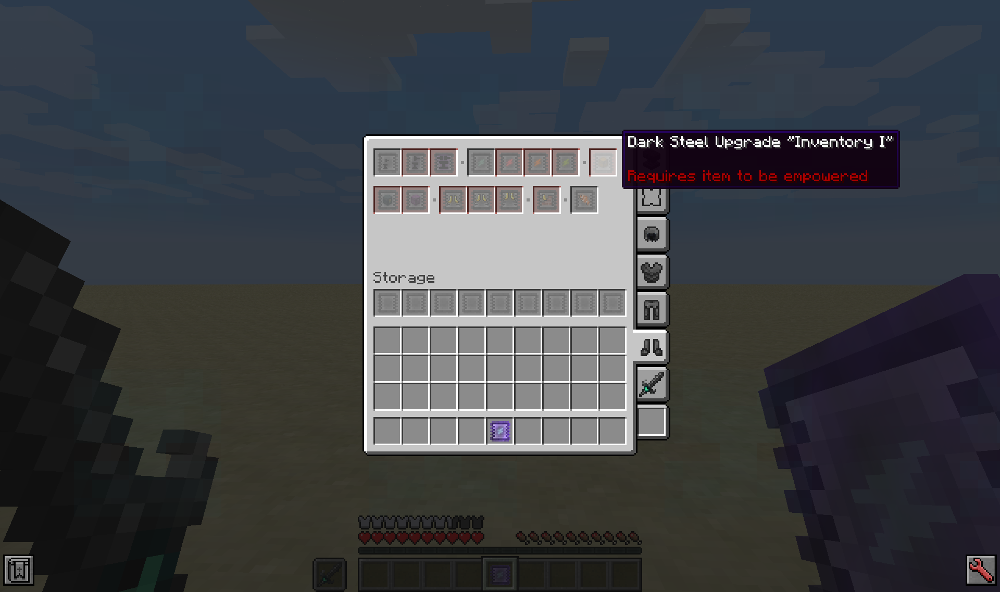
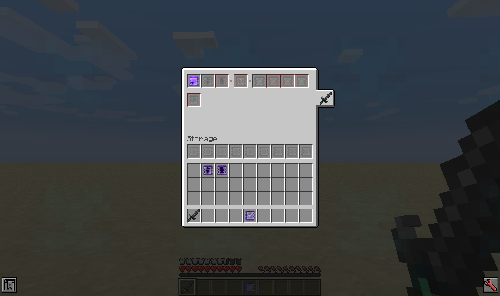
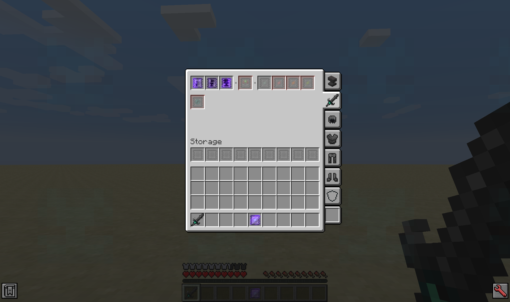

# Guide: Dark Steel Upgrades

The Dark Steel Upgrade system was overhauled in Ender IO 5.0.49, and is now based on specific upgrade Items and GUIs rather than the old combining items in an Anvil system.  This guide explains how to use the new system.

Dark Steel Upgrade is sometimes shortened to DSU.

## What You Will Need

You will need some [[Dark|List-of-Dark-Weapons-Tools-and-Armor]], [[Ender|List-of-Ender-Weapons-Tools-and-Armor]], or [[Stellar|List-of-Stellar-Weapons-Tools-and-Armor]] (from the Endergy Add-on) equipment, and some [[Dark Steel Upgrades]].  You will also need enough Experience to activate the upgrades.

While not immediately necessary, you will want some kind of [[Dark Anvil|Guide-Dark-Steel-Upgrades#dark-anvils]].  Some of Ender IO's XP storage tools ([[Experience Rod]], [[Experience Obelisk]], and/or [[Tank|Fluid Tanks]] filled with [[Liquid XP|Fluids#liquid-xp]]) will also come in handy.

## Obtaining Upgrades

### Crafting (Inactive Upgrades)

You can craft the **inactive** Upgrades by using the [[Blank Dark Steel Upgrade|Dark-Steel-Upgrades#blank-dark-steel-upgrade]] Item, and then crafting that further into the upgrade you want.  You must activate this item using Experience before it can be applied.

Inactive Upgrades do *not* have an Enchantment Shimmer, and their tooltips give info on activating them.

### Activating Upgrades

There are 2 ways to activate Dark Steel Upgrades.

1. Use Experience stored on the player by holding the inactive upgrade and Right Clicking (do not hold Shift).  This will use a number of levels specified on the inactive upgrade's tool tip.

As with any vanilla Experience usage, this uses whole levels directly.  Consuming 4 levels while level 30 will bring you down to level 26 (and consume approximately 400 Experience Points) where as consuming 4 levels while only being level 4 would bring you down to level 0 (and only use approximately 40 Experience Points).  Storing excess Experience is recommended.

2. Place the inactive upgrade in a Ender IO Tank filled with Liquid XP.

As with other uses of Liquid XP, this will use the exact amount required to activate the upgrade (ex. 4 levels = 800 Liquid XP, which is exactly enough to activate a Dark Steel Upgrade needing 4 levels).  However, for particularly expensive upgrades there may not be a large enough Ender IO Tank to hold enough Liquid XP to activate the item.

An activated Dark Steel Upgrade has an Enchantment Shimmer, and includes some information on how it can be installed in the tool tip.

### Salvaging Upgrades

As we will see later in this guide, you can remove upgrades from equipment by using a Dark Anvil.  Partially upgraded Dark Steel equipment often spawns in loot chests.

## Installing Upgrades (Insert Only)

More details about the Dark Steel Upgrade's Graphical User Interface (DSU GUI) is in the next section.

If you do not have any kind of Dark Anvil available, then you can Shift + Right Click any Dark Steel Upgrade to open the DSU GUI in an Insert Only mode.  The only equipment that will be visible is the armor you have equipped, and items in your main or off hand (recommend putting tools in your off-hand).  Please make sure you have the correct item tab selected when inserting upgrades in this mode.

While in Insert Only mode, the Storage Slots should not be usable (was an issue on very early post-overhaul versions), and installed upgrade cannot be removed (the slot's background disappears).

## Editing Upgrades (Insert, Extract, and Store)

By using a Dark Anvil, you have full access to an item's DSU GUI.  The type of Dark Anvil used will determine what items are available to edit.

There are several ways to open the DSU GUI.

* Use a Dark Steel Anvil or Dark Paper Anvil.

* Shift + Right Click any Dark Steel Upgrade (even a Blank DSU).  Dark Anvil Upgrade required to not be Insert Only.

* Have a Dark Anvil Upgrade installed and use a Keybind (no default, set yourself in the Controls menu).

* Shift + Right Click any piece of Equipment that has a Dark Anvil Upgrade and does *not* have a special Shift + Right Click Action (like Travel).

The level of access will generally be the *best* one you have access to with the items equipped (armor + both hands).

***

The DSU GUI has tabs on the right side showing the different pieces of equipment that can be edited.  Depending on the Dark Anvil used, you may see a vanilla Anvil GUI tabs, then tabs for the main hand, helmet, chestplate, leggings, boots, and the off-hand.  The final slot at the bottom can accept any piece of equipment from the inventory to reach that item's DSU GUI.

The main GUI has the player's current inventory at the bottom, a row of inactive Storage Slots in the middle, and places for Active Upgrades up top.

The Storage slots are there to store Upgrades you want to have on hand, but not be active at that time.  There are 9 available.

The active slots up top are there to hold active upgrades.  If you hover over a slot, it will tell you the name of the upgrade, and if it requires other upgrades before it can be inserted.  A normal slot can accept the upgrade.  A red background requires a previous upgrade to be installed first.  An upgrade with the background slot removed indicates the upgrade cannot be removed at all (are in Insert Only mode, or are trying to extract something like Empowered I from a Staff of Travelling).

You cannot insert upgrades unless any required upgrades are already active.  Similarly, you cannot remove an upgrade unless any upgrades that depend on it are removed prior.

## Dark Anvils

There are 5 Dark Anvils in Ender IO.  2 are in-world and automatically max tier, while 3 are upgrades with increasing tiers.

Editing Dark Steel Upgrades does not use an Anvil's Durability.

### Dark Paper Anvil

The cheapest Dark Anvil.  The [[Dark Paper Anvil]] is an in-world Anvil that will give you full access to the DSU GUI.  However, when used as a vanilla Anvil it has minimal durability (will break after 3 uses).

### Dark Steel Anvil

The [[Dark Steel Anvil]] is the other in-world Anvil.  It also gives full access to the DSU GUI, and when used as a vanilla Anvil has much greater durability (roughly twice as much as the vanilla Anvil).

### Dark Anvil Upgrades

These can be installed on any piece of Dark equipment.  Like with other tiered upgrades, they have to be applied sequentially.  You will have to close and reopen the DSU GUI to update which anvil you are using.

#### Micro Anvil

The Micro Anvil Upgrade allows you to edit only the equipment it is installed in.  It also allows you to open the DSU GUI by Shift + Right Clicking that item (as long as it doesn't have another Shift + Right Click ability).

#### Mini Anvil

The Mini Anvil Upgrade allows you to edit any equipped items (armor and both hands).  You really only need 1 to be able to edit any piece of equipment, though it often requires some manual inventory management.

#### Pocket Anvil

The Pocket Anvil Upgrade gives full access to a Dark Anvil, including an infinite durability vanilla Anvil mode and the "any equipment" insertion slot.

