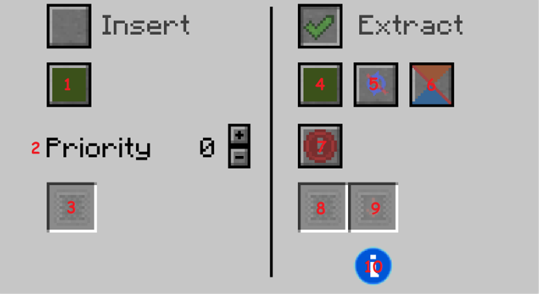

# Item Conduit

The Item Conduit transfers items between containers.

The GUI is split between the 2 modes of an Item Conduit: *insert* and *extract*. They can be toggled independently.

## Insert

Insertion can be configured in these ways:

### Channels (*1*)

Channels are used to split a single item conduit network into multiple networks that act independently.

There are 16 different channels. Each of them has a different color, corresponding to the 16 minecraft colors: 

Green, Brown, Blue, Purple, Cyan, Light Gray, Gray, Pink, Lime, Yellow, Light Blue, Magenta, Orange, White, Black

### Priority (*2*)

The insertion uses the priority system. The priority is represented by an integer.

*The items will be inserted into the containers with the highest priority first.*

### Filter Upgrades (*3*)

Insertion can be filtered. There is a single slot for filters.

## Extract

Extraction can be configured in these ways:

### Channels (*4*)

Channels are used to split a single item conduit network into multiple networks that act independently.

There are 16 different channels. Each of them has a different color, corresponding to the 16 minecraft colors: 

Green, Brown, Blue, Purple, Cyan, Light Gray, Gray, Pink, Lime, Yellow, Light Blue, Magenta, Orange, White, Black

### Round Robin (*5*)

If Round Robin is disabled, items will be inserted normally, Nearest-First, into the containers with the highest priority.

If Round Robin is enabled, items will be split equally between the containers with the highest priority.

### Self Feed (*6*)

If Self Feed is enabled, the conduits will be able to insert items into the container from which they extracted them.

### Redstone Mode (*7*)

Controls when the extraction should happen in regards to *Redstone Signal*. It can be set to these modes:

#### Always active
Extraction is always active, ignoring redstone signal.

#### Active with signal
Extraction only happens if the conduit receives a redstone signal(power 1-15).

If the redstone signal is transmitted by a redstone conduit, the Signal Color can be set.

#### Active without signal
Extraction only happens if the conduit doesn't receive a redstone signal(power 0).

If the redstone signal is transmitted by a redstone conduit, the Signal Color can be set.

#### Never active
Extraction is never active, ignoring redstone signal.

### Filter Upgrades (*8*)

Extraction can be filtered. There is a single slot for filters.

### Function Upgrades (*9*)

The Speed of the Extraction can be modified using *Speed Upgrades* and *Speed Downgrades*.

By default, item conduits extract 4 items per operation.

There's an info button (*10*) in the GUI that shows the *Effective Speed* while Hovering.

#### Speed Upgrades

Every added Speed Upgrade increases extraction speed by 4 items per operation.

*The Maximum Amount of Speed Upgrades that can be added in an item conduit is 15*, for a maximum extraction speed of 64 items per operation!

#### Speed Downgrades

*The Maximum Amount of Speed Downgrades that can be added in an item conduit is 3!*

**1 added Speed Downgrade decreases extraction speed to 1 item per operation(*THE MINIMUM EXTRACTION SPEED*).**

**2 added Speed Downgrades decrease extraction speed to 2 items per operation.**

**3 added Speed Downgrades decrease extraction speed to 3 items per operation.**
