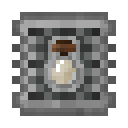
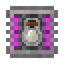

# Item Filters

## Basic Item Filter

* **Filters items with whitelist / blacklist and metadata options.**
* Used inside the *Input/Output Filter Upgrade* slot of the [[Item Conduit]].
* Has 5 item slots.

### Options:

* **Whitelist** *(Default)* / **Blacklist**
* **Metadata**
  * Match *(Default)*
  * Ignore

## Advanced Item Filter

* **Filters items with advanced configuration options.**
* Used inside the *Input/Output Filter Upgrade* slot of the [[Item Conduit]].
* Has 10 item slots.

### Options:

* **Whitelist** *(Default)* / **Blacklist**
* **Metadata**
  * Match *(Default)*
  * Ignore
* **Ore Dictionary**
  * Disabled *(Default)*
  * Enabled
* **NBT**
  * Match *(Default)*
  * Ignore
* **Damage**
  * Ignore *(Default)*
  * Up to 25% Damaged
  * More than 25% Damaged
  * Up to 50% Damaged
  * More than 50% Damaged
  * Up to 75% Damaged
  * More than 75% Damaged
  * Not Damaged
  * Damaged
  * Can be Damaged
  * Cannot be Damaged

## Limited Item Filter

* **Filters items based on their stack size in addition to the features of the [Advanced Item Filter](#advanced-item-filter).**
* Used inside the *Input/Output Filter Upgrade* slot of the [[Item Conduit]].
* It limits the Insertion / Extraction into / from a connected inventory so that, in the inventory, there is always the number of items equal to the limit set inside the filter.
* Has 10 item slots.

### Options:

* **Metadata**
  * Match *(Default)*
  * Ignore
* **Ore Dictionary**
  * Disabled *(Default)*
  * Enabled
* **NBT**
  * Match *(Default)*
  * Ignore
* **Damage**
  * Ignore *(Default)*
  * Up to 25% Damaged
  * More than 25% Damaged
  * Up to 50% Damaged
  * More than 50% Damaged
  * Up to 75% Damaged
  * More than 75% Damaged
  * Not Damaged
  * Damaged
  * Can be Damaged
  * Cannot be Damaged

## Big Item Filter

* **Filters even more items with the same options as the [Basic Item Filter](#basic-item-filter).**
* Used inside the *Input/Output Filter Upgrade* slot of the [[Item Conduit]].
* Has 36 item slots.

### Options:

* **Whitelist** *(Default)* / **Blacklist**
* **Metadata**
  * Match *(Default)*
  * Ignore

## Advanced Big Item Filter

* **Filters even more items with advanced configuration options.**
* Used inside the *Input/Output Filter Upgrade* slot of the [[Item Conduit]].
* Has 36 item slots.

### Options:

* **Whitelist** *(Default)* / **Blacklist**
* **Metadata**
  * Match *(Default)*
  * Ignore
* **Ore Dictionary**
  * Disabled *(Default)*
  * Enabled
* **NBT**
  * Match *(Default)*
  * Ignore
* **Damage**
  * Ignore *(Default)*
  * Up to 25% Damaged
  * More than 25% Damaged
  * Up to 50% Damaged
  * More than 50% Damaged
  * Up to 75% Damaged
  * More than 75% Damaged
  * Not Damaged
  * Damaged
  * Can be Damaged
  * Cannot be Damaged

## Existing Item Filter

* **Filters items based on a snapshot of the connected inventory.**
* Used inside the *Input/Output Filter Upgrade* slot of the [[Item Conduit]].

### Options:

* **Metadata**
  * Ignore *(Default)*
  * Match
* **Whitelist** *(Default)* / **Blacklist**
* **NBT**
  * Ignore *(Default)*
  * Match
* **Ore Dictionary**
  * Disabled *(Default)*
  * Enabled
* **Snapshot**: Optional: If no snapshot is set, the inventory content will be used as a filter.
* **Merge**: Merge the current snapshot with a new one.
* **Clear**: Clear the snapshot.
* **Show**: Show the current snapshot.

## Mod Item Filter

* **Filters items based on the mod they come from.**
* Used inside the *Input/Output Filter Upgrade* slot of the [[Item Conduit]].
* Has 3 mod slots.

### Options:

* **Whitelist** *(Default)* / **Blacklist**
* **Input Slots**: For items; their mods will be automatically detected.
* **Delete Buttons**: For each mod slot.

## Power Item Filter

* **Filters items based on their current energy.**
* Used inside the *Input/Output Filter Upgrade* slot of the [[Item Conduit]].

### Options:

* **Comparison Mode**
  * = *(Default)*
  * \>=
  * \>
  * <
  * <=
* **Power Percentage**
  * 100% *(Default)*
  * 0%
  * 25%
  * 50%
  * 75%

## Soul Item Filter

* **Filters [[Soul Vials|Soul Vial]] based on mob id.**
* Used inside the *Input/Output Filter Upgrade* slot of the [[Item Conduit]].
* Has 5 [[Soul Vials|Soul Vial]] slots.

### Options:

* **Whitelist** *(Default)* / **Blacklist**
* **Sticky Mode**
  * Disabled *(Default)*
  * Enabled: Selected Items will only be sent to this or other sticky outputs.

## Big Soul Item Filter

* **Filters [[Soul Vials|Soul Vial]] based on mob id. Has more slots than the [Soul Item Filter](#soul-item-filter).**
* Used inside the *Input/Output Filter Upgrade* slot of the [[Item Conduit]].
* Has 10 [[Soul Vials|Soul Vial]] slots.

### Options:

* **Whitelist** *(Default)* / **Blacklist**
* **Sticky Mode**
  * Disabled *(Default)*
  * Enabled: Selected Items will only be sent to this or other sticky outputs.

## Enchantment Item Filter

* **Filters Enchanted Items / Books based on enchantment id. Cannot differentiate between different levels of the same enchantment.**
* Used inside the *Input/Output Filter Upgrade* slot of the [[Item Conduit]].
* Has 5 Enchantment slots.

### Options:

* **Whitelist** *(Default)* / **Blacklist**
* **Sticky Mode**
  * Disabled *(Default)*
  * Enabled: Selected Items will only be sent to this or other sticky outputs.

## Big Enchantment Item Filter

* **Filters Enchanted Items / Books based on enchantment id. Has more slots than the [Enchantment Item Filter](#enchantment-item-filter). Cannot differentiate between different levels of the same enchantment.**
* Used inside the *Input/Output Filter Upgrade* slot of the [[Item Conduit]].
* Has 10 Enchantment slots.

### Options:

* **Whitelist** *(Default)* / **Blacklist**
* **Sticky Mode**
  * Disabled *(Default)*
  * Enabled: Selected Items will only be sent to this or other sticky outputs.

## Forestry Integration

### Species Item Filter

* **Filters Forestry Species (of bees, trees etc.).**
* Used inside the *Input/Output Filter Upgrade* slot of the [[Item Conduit]].
* Has 5 Species slots.

### Options:

* **Whitelist** *(Default)* / **Blacklist**
* **Species Type**
  * Both *(Default)*
  * Primary
  * Secondary