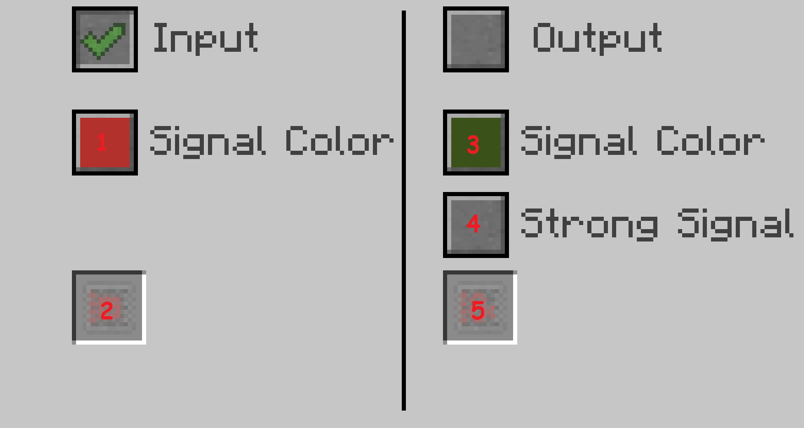
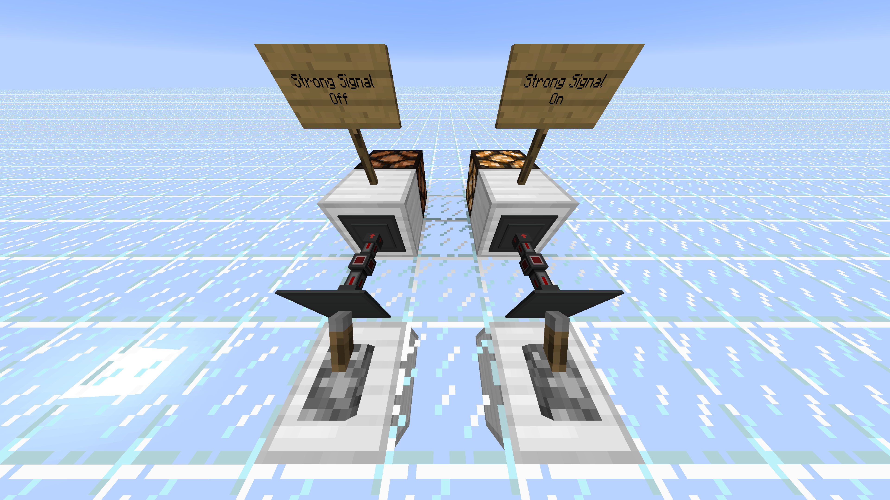

# Redstone Conduit

The Redstone Conduit transfers Redstone Signal between blocks.

The GUI is split between the 2 modes of a Redstone Conduit: *input* and *output*. They can be toggled independently.

## Input

Input can be configured in these ways:

### Signal Color (*1*)

Signal Colors are used to split a single redstone conduit network into multiple networks that act independently.

There are 16 different signal colors, corresponding to the 16 minecraft colors:

Green, Brown, Blue, Purple, Cyan, Light Gray, Gray, Pink, Lime, Yellow, Light Blue, Magenta, Orange, White, Black

### Filter Upgrades (*2*)

There are different [[Redstone Filters]] that can be inserted into this slot, to change the behavior of Redstone Conduits.

## Output

Redstone Conduits Output a Signal Strength equal to the sum of all Input Signal Strengths on the Channel, capped at 15. This behavior can be changed by [[Redstone Filters]].

Output can be configured in these ways:

### Signal Color (*3*)

Signal Colors are used to split a single redstone conduit network into multiple networks that act independently.

There are 16 different signal colors, corresponding to the 16 Minecraft colors:

Green, Brown, Blue, Purple, Cyan, Light Gray, Gray, Pink, Lime, Yellow, Light Blue, Magenta, Orange, White, Black

### Strong Signal (*4*)

Blocks can be powered, activated or both.

Powered Blocks activate adjacent blocks.

If Strong Signal is Disabled, the conduit will be powered, and it will activate any adjacent blocks like redstone lamps.

If Strong Signal is Enabled, the conduit will power and activate the adjacent blocks, which themselves will activate any adjacent blocks to them.

The best way to visualize this is with a screenshot:

On the left, Strong Signal is Off, so the iron block is activated but not powered, so the redstone lamp doesn't activate.

On the right, Strong Signal is On, so the iron block is both powered and activated, so the redstone lamp activates.

### Filter Upgrades (*5*)

There are different [[Redstone Filters]] that can be inserted into this slot, to change the behavior of Redstone Conduits.
