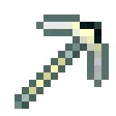

# Stellar Pickaxe

The Stellar Pickaxe is a pickaxe added by Endergy.

It can be enchanted with any Pickaxe Enchantments (Vanilla or Modded).

It has a Harvest Level = 5 (equivalent to a Cobalt Pickaxe), but it can be configured to have a Harvest Level = 3 (equivalent to a Diamond Pickaxe), by switching canMineTiCArdite = false in enderio.cfg.

## Dark Steel Upgrades:

* Carpeting
  - Mining Range = Mining Volume + 1, if Depth is *NOT* present(See Explosive)
  - Mining Range = Mining Volume - 1, if Depth is present(See Explosive)
  - Flattens the explosive force into a carpet.
* Depth
  - Mining Depth = Mining Volume + 1 (See Explosive)
  - Directs the explosive force away from the player.
* Direct
  - Teleports mined things into your inventory
* Empowered
  - Empowered I
    * Max Power: 100,000 µI
    * Damage absorbed by power: 50%
  - Empowered II
    * Max Power: 150,000 µI
    * Damage absorbed by power: 60%
  - Empowered III
    * Max Power: 250,000 µI
    * Damage absorbed by power: 70%
  - Empowered IV
    * Max Power: 1,000,000 µI
    * Damage absorbed by power: 85%
  - Empowered V
    * Max Power: 2,500,000 µI
    * Damage absorbed by power: 95%
* Explosive
  - Explosive I:
    * Mining Volume = 1
    * Adds explosive power to the pickaxe, damaging surrounding blocks while mining.
    * For problems that look like nails.
  - Explosive II:
    * Mining Volume = 2
    * Adds more explosive power to the pickaxe, damaging surrounding blocks while mining.
    * For problems that look like nails.
  - Explosive III:
    * Mining Volume = 3
    * Adds even more explosive power to the pickaxe, damaging surrounding blocks while mining.
    * For problems that look like nails.
  - Explosive IV:
    * Mining Volume = 4
    * Adds ridiculous explosive power to the pickaxe, damaging surrounding blocks while mining.
    * For problems that look like combs.
  - Explosive V:
    * Mining Volume = 5
    * Adds ludicrous explosive power to the pickaxe, damaging surrounding blocks while mining.
    * https://youtu.be/ygE01sOhzz0

      ***Henry and tterrag want you to watch the full movie.***

      ***"You owe it to yourself" - tterrag***
* Micro Anvil
  - Allows editing upgrades of a single item in the field.
  - Activate with a hotkey or by shift-right-clicking any upgradeable item that doesn't do anything else when doing that.
* Mini Anvil
  - Allows editing upgrades of all equiped items in the field.
  - Activate with a hotkey or by shift-right-clicking any upgradeable item that doesn't do anything else when doing that.
* Pocket Anvil
  - Provides full anvil functionality and allows editing upgrades of any items in the field.
  - Activate with a hotkey or by shift-right-clicking any upgradeable item that doesn't do anything else when doing that.
* Spoon
  - Who needs a shovel when you have a spoon...
* Travel
  - Hold Shift and Right-Click to teleport or activate a travel anchor
