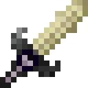

# The Ender Mk2

The Ender Mk2 is a sword added by Ender IO.

It can be enchanted with any Sword Enchantments (Vanilla or Modded).

Skull and Ender Pearl drops increase when killing mobs with the Ender (**doesn't have to be Powered**).

When it is Powered, Endermen can't teleport once hit, and it has Extra Damage and Speed:

* Not Powered: Attack Speed = 1.6 and Attack Damage = 9
* Empowered I (and Powered): Attack Speed = 2 and Attack Damage = 10
* Empowered II (and Powered): Attack Speed = 2.05 and Attack Damage = 11
* Empowered III (and Powered): Attack Speed = 2.1 and Attack Damage = 12
* Empowered IV (and Powered): Attack Speed = 2.15 and Attack Damage = 13
* Empowered V (and Powered): Attack Speed = 2.2 and Attack Damage = 14

## Dark Steel Upgrades:

* Direct 
  - Teleports mined things into your inventory
* Empowered
  - Empowered I
    * Max Power: 100,000 µI
    * Damage absorbed by power: 50%
  - Empowered II
    * Max Power: 150,000 µI
    * Damage absorbed by power: 60%
  - Empowered III
    * Max Power: 250,000 µI
    * Damage absorbed by power: 70%
  - Empowered IV
    * Max Power: 1,000,000 µI
    * Damage absorbed by power: 85%
  - Empowered V
    * Max Power: 2,500,000 µI
    * Damage absorbed by power: 95%
* Travel
  - Hold Shift and Right-Click to teleport or activate a travel anchor
